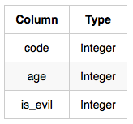

## Problem

Harry Potter and his friends are at Ollivander's with Ron, finally replacing Charlie's old broken wand.

Hermione decides the best way to choose is by determining the minimum number of gold galleons needed to buy each non-evil wand of high power and age. Write a query to print the id, age, coins_needed, and power of the wands that Ron's interested in, sorted in order of descending power. If more than one wand has same power, sort the result in order of descending age.

### Input Format

The following tables contain data on the wands in Ollivander's inventory:

Wands: The id is the id of the wand, code is the code of the wand, coins_needed is the total number of gold galleons needed to buy the wand, and power denotes the quality of the wand (the higher the power, the better the wand is).




## Solution!

```sql

SELECT w.id, wp.age, w.coins_needed, w.power
FROM Wands w
JOIN Wands_Property wp ON w.code = wp.code
JOIN (
    SELECT wp.age, MIN(w.coins_needed) AS min_gold, w.power
    FROM Wands w
    JOIN Wands_Property wp ON w.code = wp.code
    WHERE wp.is_evil = 0
    GROUP BY wp.age, w.power
) mc ON wp.age = mc.age
     AND w.power = mc.power
     AND w.coins_needed = mc.min_gold
ORDER BY w.power DESC, wp.age DESC;

```

## Explanation

First select the `id`, `age`, `coins_needed`, and `power` from table . Then time to join table first join it with `Wands_Property` table. then need the conditional join with minimum power for that , first create a table with minimum number of gold is needed to join.
`JOIN (
    SELECT wp.age, MIN(w.coins_needed) AS min_gold, w.power
    FROM Wands w
    JOIN Wands_Property wp ON w.code = wp.code
    WHERE wp.is_evil = 0
    GROUP BY wp.age, w.power
)`

This line of query only finds the `min` number of gold of where the `age` `power` is same. then simple join the table on the condition.
